# Datamodellering med ER-modeller

## Fra "Miniverden" til Realisert Database
- **Databasen som Modell** av en del av virkeligheten: Databaser er ikke bare lagringsenheter; de representerer en modell av virkelige prosesser og objekter.
- **Miniverden** refererer til den spesifikke delen av virkeligheten vi ønsker å modellere. Denne tilnærmingen hjelper oss med å identifisere:
  - **Relevante (data-)Objekter**: De grunnleggende elementene vi vil representere i databasen.
  - **Relevante Sammenhenger** mellom objekter: Hvordan disse objektene er relatert eller forbundet.
  - **Relevante Regler** som gjelder: Restriksjoner og forretningslogikk som styrer objektene og deres interaksjoner.

 Prosessen går fra **Miniverden** til **Konseptuell Modell**, deretter til **Logisk Modell** og til slutt til **Fysisk Modell (Database)**.

  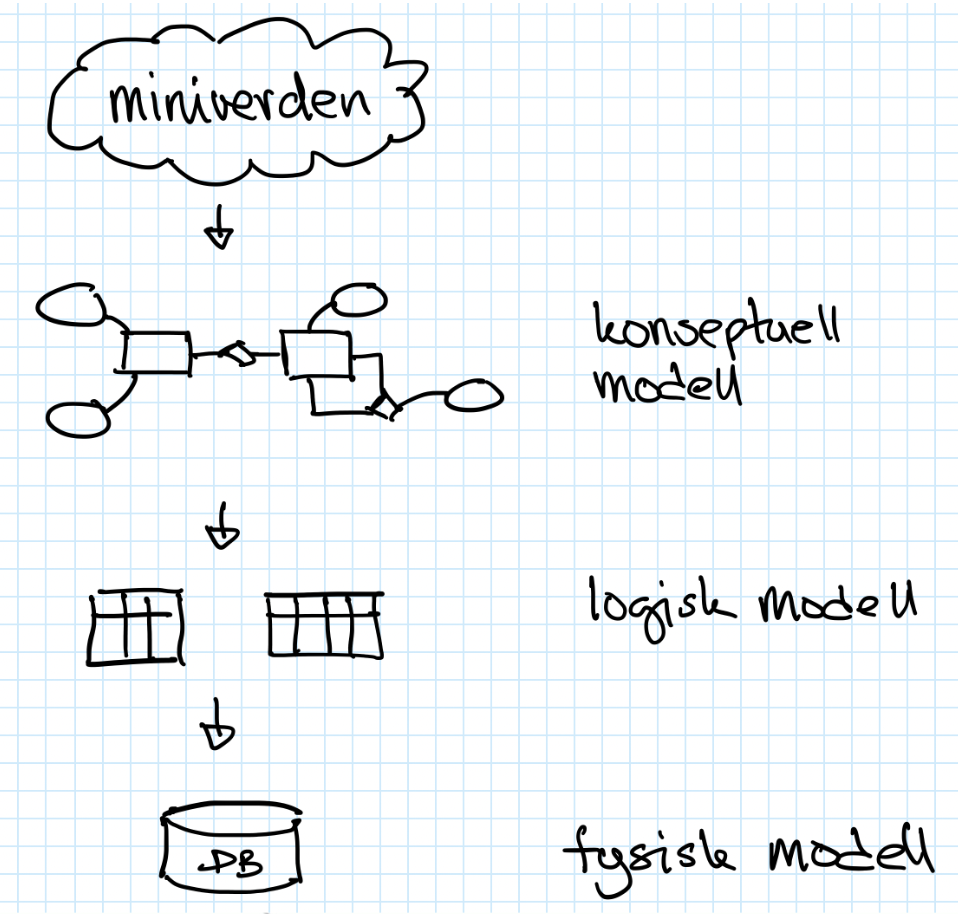

## Entity-Relationship-Modeller
- **Mange Dialekter**: Det finnes forskjellige måter å representere ER-modeller på.
- **Konseptuell Datamodell**: Denne modellen fokuserer på høynivå, begrepsorientert design som er lett forståelig.
  - **Datastruktur**:
    - **Entiteter (Objekter)** og **Relasjoner** mellom disse.
    - **Entitetsklasser** og **Relasjonsklasser**.
    - **Attributter**: Egenskaper eller beskrivende detaljer av entiteter og relasjoner.
  - **Restriksjoner (Constraints)**:
    - Nøkkelsrestriksjoner og datatyper for attributter.
    - Strukturelle restriksjoner som påvirker hvordan dataene er organisert.
- Dataoperasjoner som innsetting, endring, sletting og spørring er mindre relevant i denne fasen.

  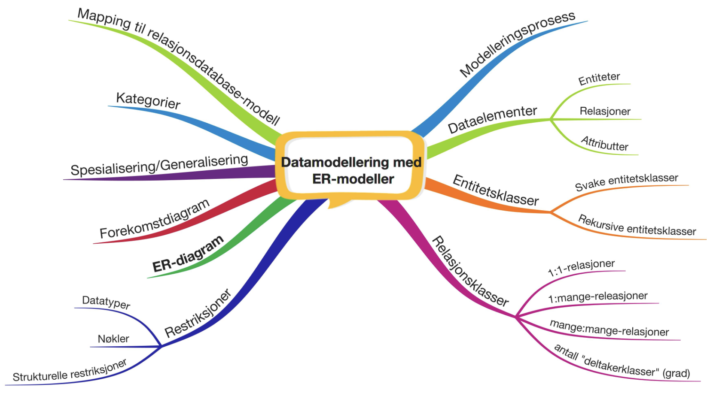

## Entiteter og Entitetsklasser
- **Entitet**: Et objekt eller element som har en eksistens i miniverdenen, med spesifikke egenskaper representert av **attributter**.
  - Attributter henter verdier fra et **domene** (datatype).
  - Typer av attributter inkluderer enkle, sammensatte, avledede og nøkkelattributter (unike identifikatorer).

  

- **Entitetsklasse/-type**: En gruppe av likeartede entiteter som deler felles egenskaper. Alle entitetsklasser krever en unik identifikator (nøkkel).

  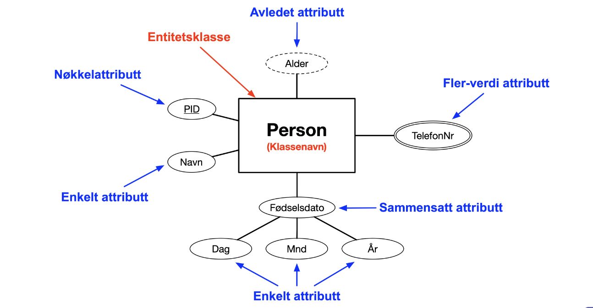

## Relasjoner og Relasjonsklasser
- **Relasjon**: En forbindelse eller et forhold mellom to eller flere entiteter. For eksempel, "en student har tatt eksamen i et emne".
  - Kan ha egenskaper, lik entiteter, representert ved attributter.
  - Relasjonen eksisterer kun når de relevante entitetene er til stede.

  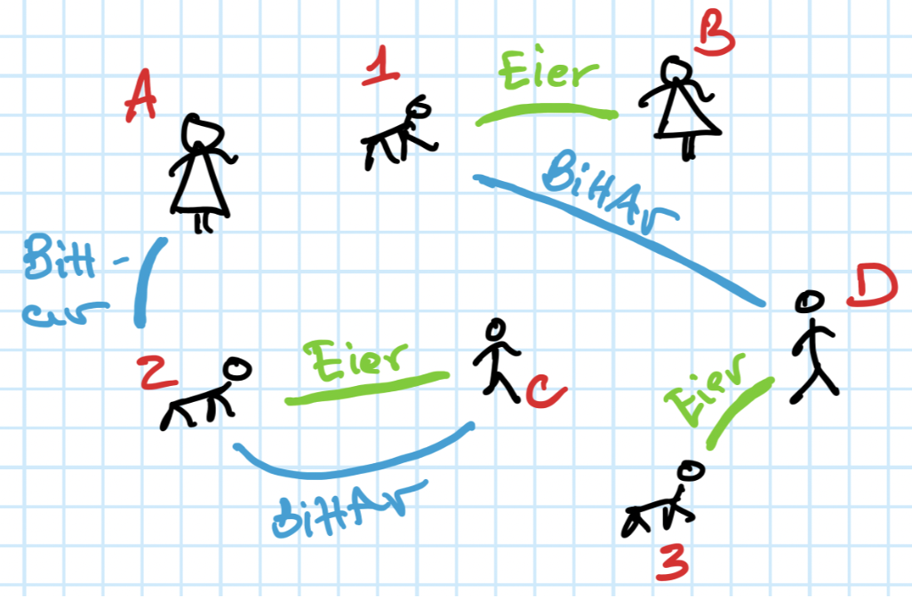

- **Relasjonsklasser/-typer**: En samling av likeartede relasjoner mellom de samme entitetsklassene.

  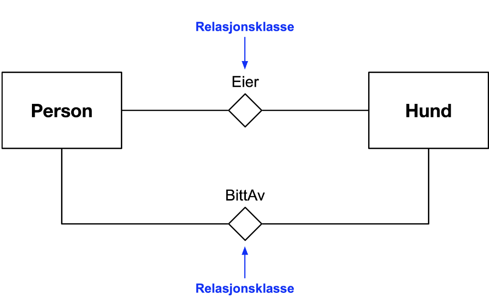

- **Restriksjoner**:
  - **Kardinalitetsforhold**: Begrenser antall entiteter en entitet kan ha relasjon til.
    

      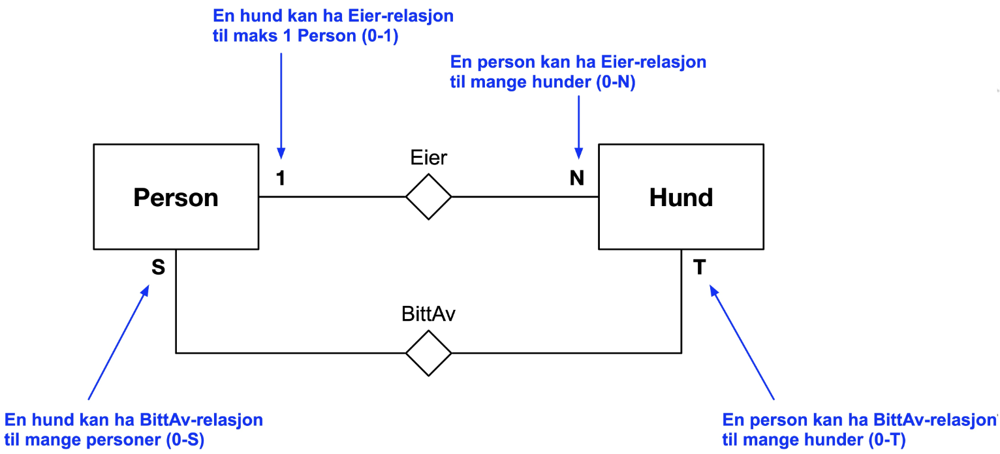
    

  - **Deltakelseskrav**: Angir om en entitet må ha en relasjon til minst en annen entitet.
    

      
    

  - **Strukturelle Restriksjoner**: Kombinerer kardinalitets- og eksistensrestriksjoner.
    

      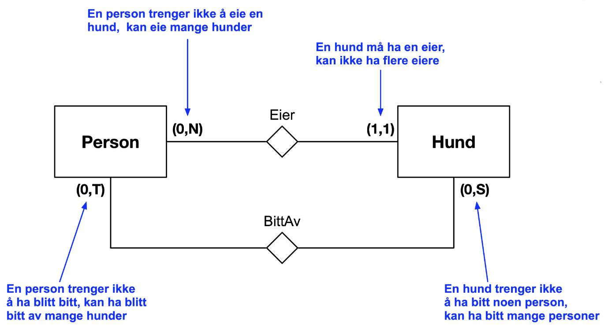
    

  - **Sammenligning**:
    - Alternative måter å spesifisere det samme.
    - Legg merke til at "maks" bytter side.
    - Husk forskjellen mellom delvis og total deltakelse.
    

      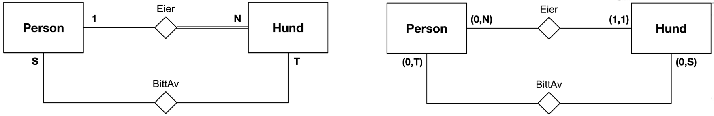
    

## Forekomst-nivå

  

## Om relasjoner
- Relasjoner kan ha __egenskaper__ som modelleres som attributter

  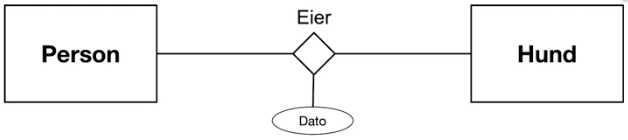

- Relasjonens __grad__ (degree) er antall entiteter som inngår

  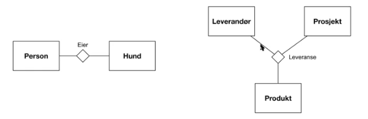

- Relasjoner eksisterer _ikke_ uten de entitetene som inngår

## Utvikling av Datamodell
- Følg disse trinnene for å utvikle en robust datamodell:
  1. Identifiser nødvendige **entitetsklasser**.
  2. Definer **attributter** for hver entitetsklasse.
  3. Identifiser nødvendige **relasjonsklasser**.
  4. Definer **attributter** for hver relasjonsklasse.
  5. Bestem **nøkler** for hver entitetsklasse.
  6. Definer **restriksjoner** for relasjonsklassene.
  7. Vurder og juster modellen etter behov.

# ER-modellering: Rekursive relasjonsklasser

## Enkelt Eksempel på en ER-modell: Emne-Student_Vurdering
Denne modellen illustrerer en grunnleggende ER-struktur hvor studenter evalueres i forskjellige emner.

  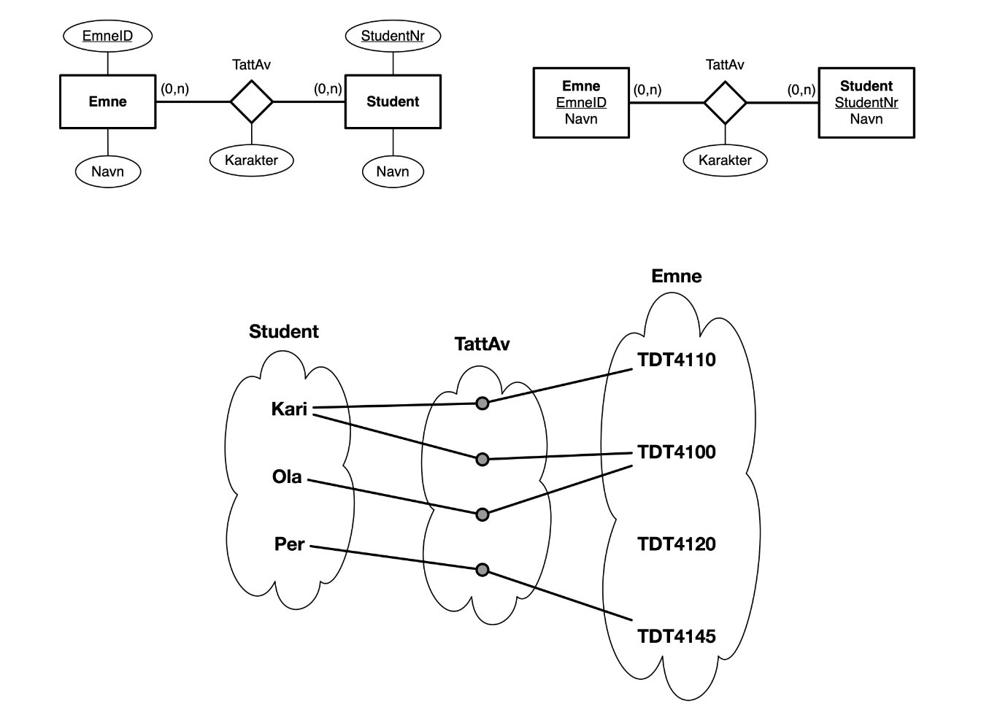

## Rekursive Relasjonsklasser
En interessant aspekt ved ER-modellering er rekursive relasjonsklasser, hvor samme entitetsklasse deltar flere ganger, men i ulike roller.

  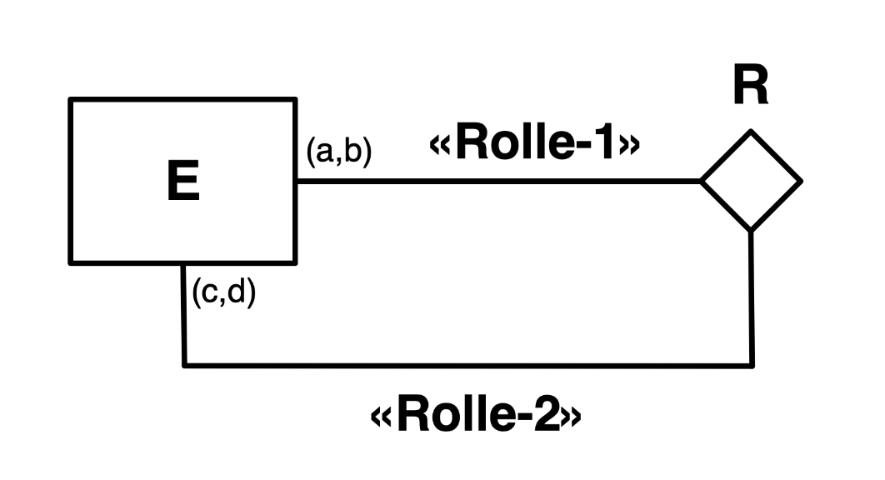

## Eksempel: Ledelseshierarki
Dette eksempelet viser et ledelseshierarki. For eksempel, Kong Harald (leder) for Statsminister Erna, som igjen er leder for ministerne Guri og Iselin. Iselin leder så statssekretærene Lucie og Lars.

  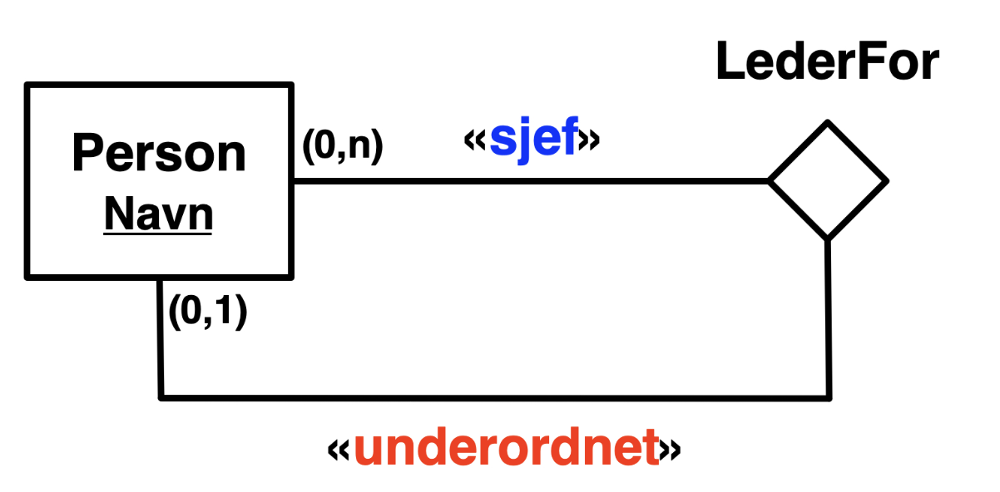
  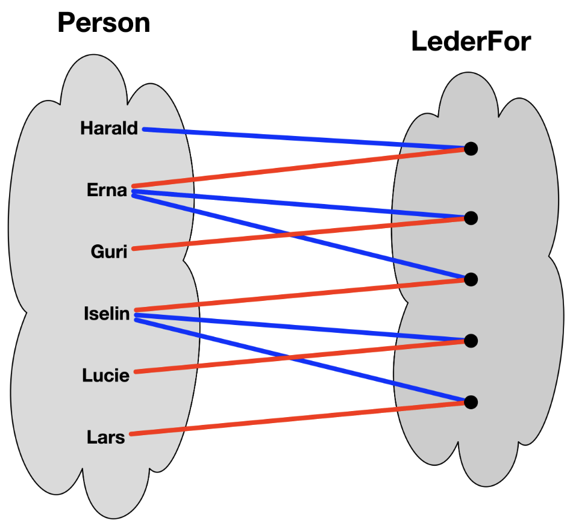

# ER-modellering: Svake entitetsklasser

## Svake Entitetsklasser
I en entitetsklasse, som er en samling unike entiteter, er det avgjørende at hver entitet kan identifiseres unikt. Et eksempel er kommuner og gater, hvor hver kommune har et unikt nummer og navn, og hver gate er unik innenfor sin kommune.

  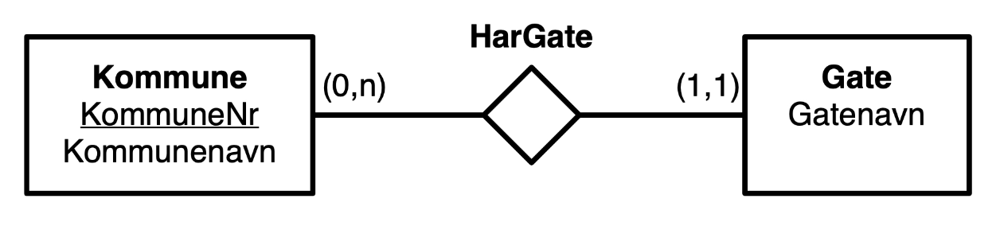

En utfordring oppstår når en entitetsklasse, som Gate, mangler en naturlig nøkkel.

En løsning kan være å introdusere et ekstra nøkkelattributt, som GateNr, som gjør Gate til en regulær entitetsklasse. Dette krever ekstra administrasjon for å sikre unikhet på tvers av kommuner.

  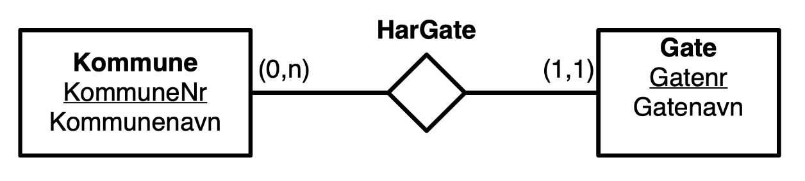

En alternativ løsning er å bruke en identifiserende relasjonsklasse for å definere svake entitetsklasser, som ikke har en egen nøkkel. Dette eliminerer behovet for et ekstra nøkkelattributt. For eksempel, i kombinasjon, blir KommuneNr og Gatenavn en unik identifikator.

  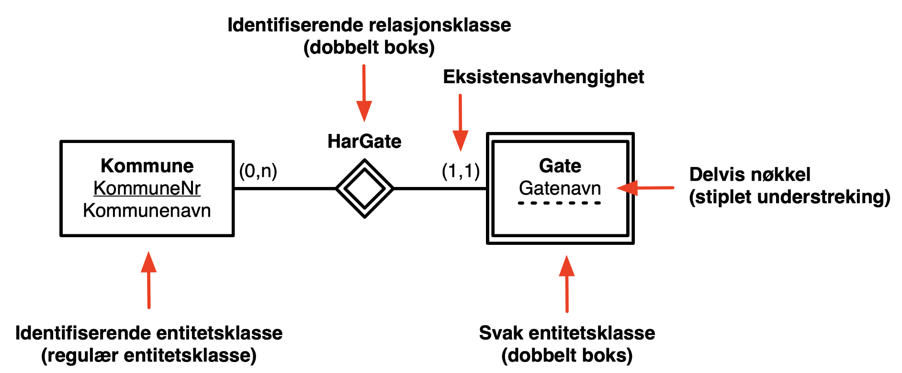

## Enhanced ER (EER)
Enhanced Entity-Relationship (EER)-modellering er en utvidelse av den standard Entity-Relationship (ER) modelleringen. EER inkluderer avanserte konsepter som spesialisering/generalisering, kategorier (union-typer), og arving av relasjonsklasser og attributter. La oss utdype disse konseptene:
- **Standard ER Pluss:**
  - **Støtte for Spesialisering/Generalisering:** Dette omfatter subklasser og superklasser.
  - **Entitetsklasser med Entiteter fra Ulike Entitetsklasser**: Dette refererer til kategorier eller union-typer.
  - **Arving**: Inkluderer arving av relasjonsklasser og attributter.

## Spesialisering/Generalisering
- **Spesialisering**: Prosessen med å definere underklasser for en gitt superklasse. Dette involverer å identifisere unike egenskaper som er spesifikke for subklassene.
- **Generalisering**: Å samle lignende entitetsklasser som subklasser under en felles superklasse. Felles egenskaper er modellert på superklassenivå.
- **Unike Egenskaper for Subklasser**: De egenskapene som er spesifikke for en subklasse, modelleres på subklassen.

  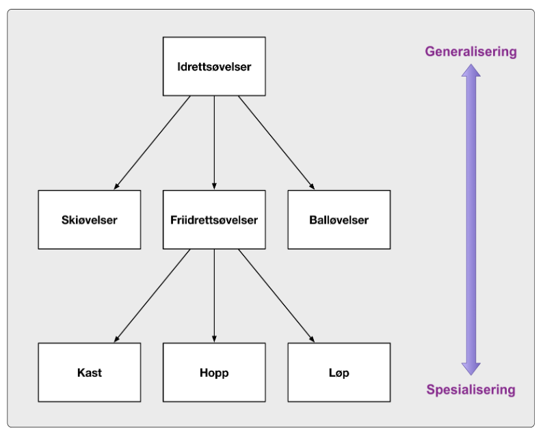

## Notasjon og Egenskaper
- **Rolle i Subklasse**: En entitet i en subklasse har alltid en rolle som en del av superklassen, men med spesielle egenskaper.
- **Arv av Attributter og Relasjoner**: Entiteter i subklasser arver alle attributter og relasjoner fra superklassen og kan ha sine egne unike attributter og relasjonsklasser.
- **Deltakelse i Subklasser**: Ikke alle entiteter må være med i en subklasse, men det kan være et krav. En entitet kan tilhøre bare én eller flere subklasser.

  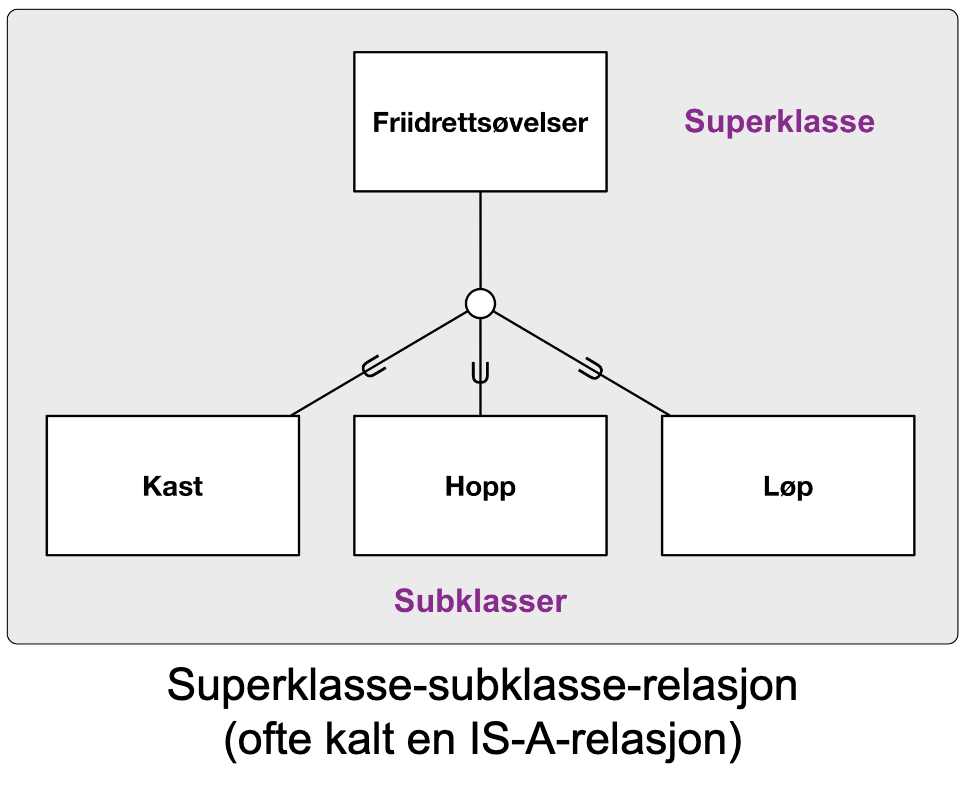

## Eksempel: Sykehus
- Dette er et konkret eksempel som illustrerer bruken av EER-modellering i en praktisk sammenheng, som et sykehusdatabase-system.

  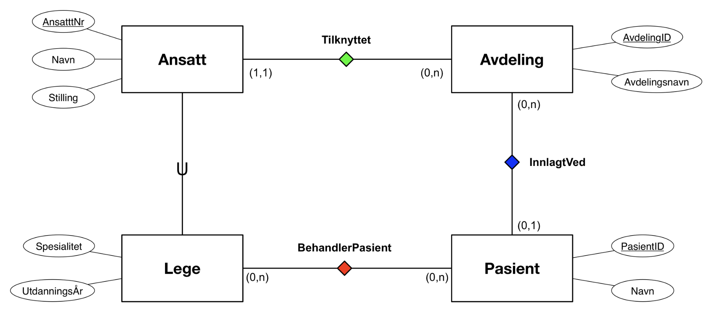

#### Forekomstdiagram

  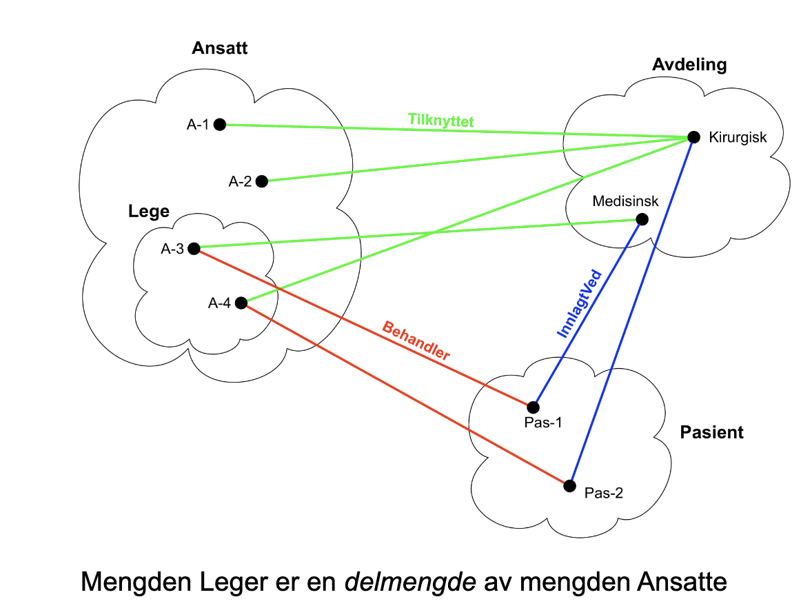

## Restriksjoner i EER-modeller

- **Deltakelse i Subklasse**: Kan være regelbasert eller brukerstyrt.

  

- **Subklassetyper**: Disjunkte (ikke-overlappende) eller overlappende.

  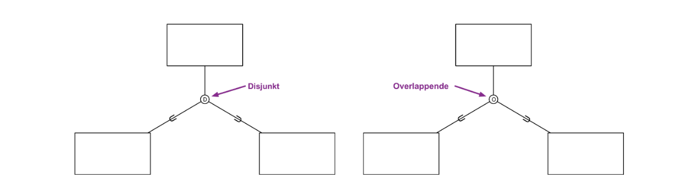

- **Spesialiseringstype**: Delvis eller total (frivillig eller tvungen).

  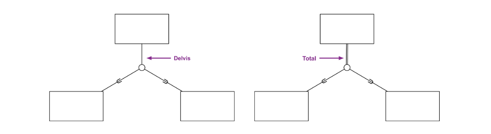

- **Kombinasjoner av Restriksjoner**: Det er fire hovedmuligheter for hvordan disse restriksjonene kan kombineres.

  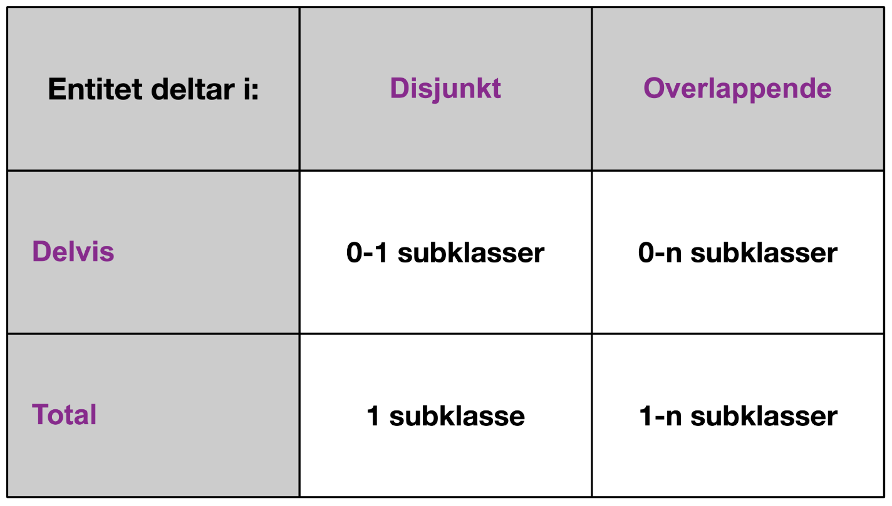

## Eksempel: Kameradatabase
- Dette eksempelet viser hvordan en ER-modell kan konverteres til en EER-modell for å gi en mer detaljert og nøyaktig representasjon av virkeligheten.

  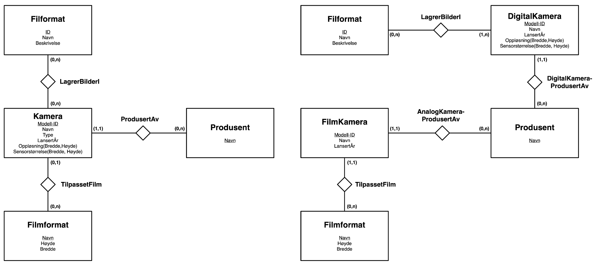

  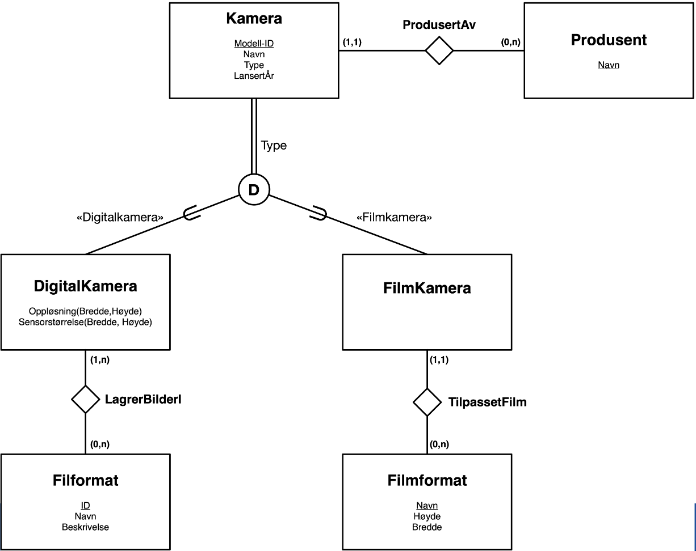

## Kategorier: Subklasser med flere superklasser
- Mengden entiteter i en kategori er en delmengde av entitetene i superklassene
- Kategorier kalles også union-klasse, derfor U i sirkelen
- JuridiskPerson er enten Selskap eller Person
- Selektiv aving

  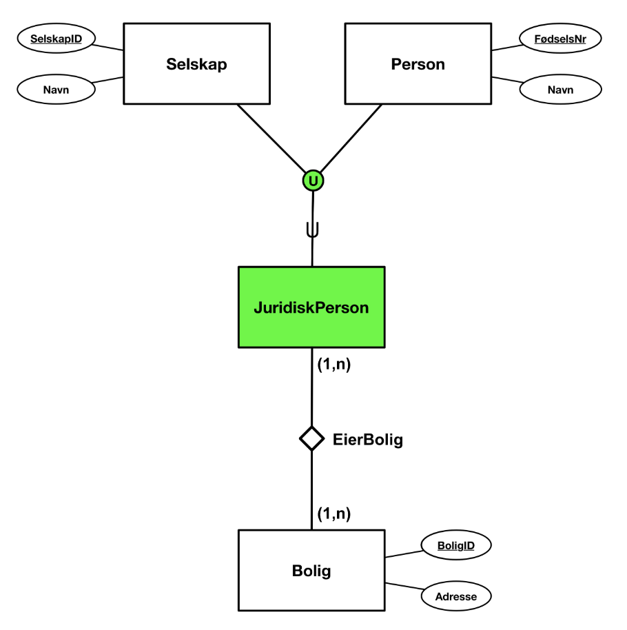

## Kategorier: Restriksjoner: Delvis/Totalt

  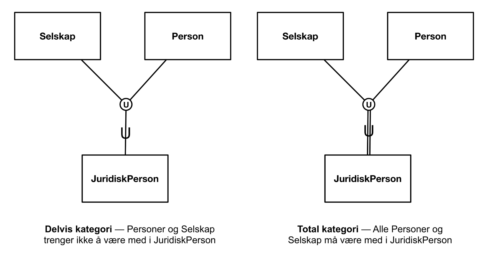

## Total kategori eller Superklasse 

  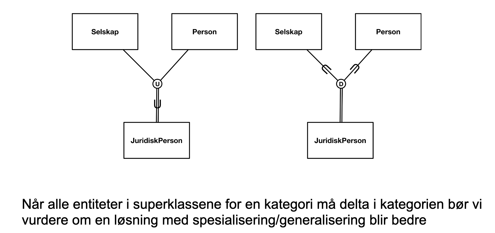

Når alle entiteter i superklasene for en kategori må delta i kategorien bør vi vurdere om en løsning med spesialisering/generalisering blir bedre
