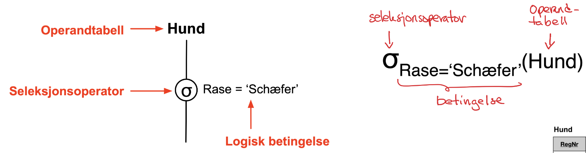

# Relasjonsdatabaser
## Intro

  

### Tabeller/Relasjoner

  

- Skjema ("intention") beskriver tabellen
    - Tabellnavn
    - Kolonner (attributter)
    - Kolonnenes datatyper
    - Restriksjoner
        - Primærnøkkel (entydig identifikator) og andre restriksjoner
- Forekomst av data ("extention")
    - Rader/tuppler med lovlige verdier
- Spesiell NULL-verdi
    - Der vi ikke har noen verdi ("ukjent eller mangler")
- Fremmednøkkel (VIKTIG)
    - Verdi som viser til en rad (tuppel) i en annen tabell (ev.samme tabell)

  

- EierPnr er en fremmednøkkel mot Person(Pnr)
- OfferPnr er en fremmednøkkel mot Person(Pnr)
- GjerningshundRegNr er en fremmednøkkel mot Hund(RegNr)

### Innhold

  
  

- Standard relasjonsdatabaser har
    - Atomiske verdier i domenene (datatypene)
    - En verdi for hvert attributt (i en rad)
    - Dette gir oss "flate, 2-dimensjonale tabeller"
- Ikke-standard relasjonsdatabaser kan ha
    - Sammensatte attributter (poster, tabeller), repeterende grupper (fler-verdi-attributter)
- **Entitetsintegritet**
    - En relasjon (tabell) er en _mengde_ tuppler (rader)
        - Kan ikke ha to like tuppler
    - Alle tabeller må ha en **primærnøkkel** (unik identifikator)
        - For å sikre at primærnøkkelen har unike verdier tillates ikke NULL-verdier i primærnøkkel (som kan bestå av flere attributter)
- **Referanseintegritet**
    - Fremmednøkler må referere til et tuppel (rad) som finnes i den tabellen det refereres til eller bare bestå av NULL-verdi(er)

## Mapping fra ER-modeller

### Regulære entitetsklasser

  

En tabell for entitetsklassen med entitetsklassen nøkkelattributt og en-verdi-attributter. For samensatte attributter beholdes "løv-attributtene".

### Svake entitetsklasser

  

En tabell for entitetsklassens delvise nøkkelattributt og en-verdi-attributter. I tillegg må nøkkelattributten(e) til den identifisernde entitetsklassen tas med som nøkkelattributter. Dette vil være en fremmednøkkel mot den aktuelletabellen som ikke kan ha NULL-verdier.

### Binære 1:1 relasjonsklasser

  

- Legger til en fremmed nøkkel i en av tabellene eller lager en egen koblingstabell. 
- Velger ofte den løsningen som gir minst NULL-verdier.

### Binære 1:n relasjonsklasser

  

Kan legge til fremmednøkkel og evt. attributter som hører til relasjonsklassen, i tabellen som representerer mange-siden i relasjonsklassen. Alternativt kan det legges til en koblingstabell.

### Binære n:m relasjonsklasser

  

Må ha egen koblingstabell med fremmednøkler til begge entitetsklasse-tabellene. Fremmednøklene utgjør sammen primærnøkkelen. Evt. attributter i relasjonsklassen tas med i koblingstabellen.

### Fler-verdiattributter

  

Fler-verdiattributt må (vanligvis) håndteres i en egen tabell, med en fremmed-nøkkel til entitetstabellen. Det kan være flere muligheter når det gjelder nøkkel i denne fler-verdi-attributt-tabellen. Hvis flere personer kan dele tlfNr blir det som illustrert over. Hvis det er maks en pers pr tlfNr, vil ikke Pnr være med i nøkkelen.

### N-ære relasjonsklasser

  

### Spesialisering/Generalisering

  

- Ingen egentlig støtte for dette
- A: Både superklasser-tabell og subklasse-tabell
- B: Bare subklasse-tabeller 
- C/D: Bare superklasse-tabell
- Kan velge ulike alternativer ulike steder i EER-modell

### Kategorier

  

- Lager egen tabell for kategori-entitetsklassen (vanlige regler, unntatt primærnøkkel)
- Superklassene har som regel ulike nøkler, lager i disse tilfellene en **spesiell primærnøkkel** for kategori-tabellen ("surrogatnøkkel")
- Legger _surrogatnøkkelen_ inn som _fremmednøkkel_ i alle superklasse-tabeller
- Legger inn et **type-attributt** i kategori-tabellen som viser hvilken super klasse hver kategori-entitet er.

## Relasjonsalgebra
- Operasjoner for å _manipulere_ tabeller
  - Vi ser kun på spørrefunksjonalitet, ikke innsetting, endring eller sletting
  - Viktig grunnlag for å forstå hva man kan gjøre med tabeller, for normaliseringsteorien og for spørreoptimalisering og spørreutføring
- Husk: Tabellforekomster er mengder av tuppler
- Operatorene er _lukket_  over tabeller 
  - Operanden(e) er tabell(er), resultatet er en ny tabell
- Mengdeoperatorer:  
  - Union, Snitt, mengdedifferande (minus), kartesisk produkt
- Spesielle operatorer
  - Seleksjon, prosjeksjon, join-operatorer

  

### Projeksjon

  
  

- Resultat-tabellen får nytt skjema
  - Består av kolonnene (attributtene) i _attributtlisten_
- Fjerner _duplikater_ i resultat-tabellen

### Seleksjon

  
  

- Velger ut _rader_ (tuppler) som oppfyller en _logisk betingelse_
  - Sammenligningsoperatorer + logiske konnektiver + parenteser
- Resultat-tabellen har samme skjema som operand-tabellen

### Kan kombinere operatorer

**Q: Finn navn brukt på mopser og labradorer**

  
  

- Må passe på rekkefølgen av operatorene
- Pass på ikke å fjerne data vi trenger senere

### Mengdeoperatorene: Union, Snitt, Differanse

- Arbeider på data fra to operand-tabeller
- Kun mellom _union-kompatible_ tabeller:
  - Samme _grad_ - dvs. like mange kolonner (attributter)
  - _Korresponderende_ kolonner er def over samme datatype (domene)

  

**Q: Navn brukt på både mops og schæfer**

  

### Kartesisk produkt (X)
Kartesisk produkt i en relasjonsdatabase sammenstiller data fra to tabeller ved å kombinere hver rad fra den ene tabellen med hver rad fra den andre. Dette skaper en "alle-mot-alle"-sammenstilling av radene, hvor resultatet inneholder hver mulig kombinasjon av rader fra de to tabellene. Denne metoden er ukritisk i sin natur og tar ikke hensyn til eventuelle relasjoner eller sammenhenger mellom dataene i de to tabellene.

Resultattabellen som genereres ved et kartesisk produkt vil inneholde alle kolonnene fra begge tabellene. Dette betyr at hvis den første tabellen har kolonner A, B, C og den andre tabellen har kolonner X, Y, Z, vil den resulterende tabellen ha kolonner A, B, C, X, Y, Z. For å unngå forvirring, spesielt når de to tabellene har kolonner med samme navn, kan man prefikse kolonnenavnene med tabellnavnet, for eksempel Hund.Navn.

Størrelsen på den resulterende tabellen i et kartesisk produkt er vanligvis stor, siden antallet rader vil være produktet av antall rader i de to opprinnelige tabellene. Hvis den første tabellen har r rader og den andre har s rader, vil resultatet bestå av r*s rader.

Selv om kartesiske produkter sjelden er målet for en spørring i seg selv, danner de grunnlaget for mer spesialiserte sammenstillingsoperatorer som join-operasjoner. Joins bruker en lignende mekanisme, men legger til kriterier som begrenser hvilke rader som skal kombineres, basert på relasjoner mellom dataene i tabellene.

  

**Eksempel på kartesisk produkt**

  

### JOIN - Kritisk sammenstilling
- Kartesisk produkt er _ukritisk_ sammenstiling
  - Alle rader kombineres med alle rader, gir store resultattabeller
- Join-operatorer kombinerer _relaterte_ rader
  - Radene i resultat-tabellen oppfyller ein _join-betingelse_
- Join-operatoren kan implementeres _mye billigere_ enn kartesisk produkt
- EQUIJOIN - basert på likhet, vi kan også ha generaliserte join-betingelser (<>, <, >)

  

**Q: RegNr og Navn for hunder som har bitt Per som har PNr = 3**

  

### Alternative løsninger
- Gir samme resultat, varierer i effektivitet/kostnad

  

### Equijoin
**Q: Bilder tatt av fotografen Wilse**

  

- Kombinerer rader basert på _likhet_
  - Ett eller flere par av kolonner (fra hver sin operandtabell)
- _Filterer vekk_ rader som ikke matcher
  - Foto 4 (Nidaros) som har ukjent fotograf
  - Foto 3 (Leibovitz) som ikke har Foto
- **Alltid ett eller flere par kolonner med like verdier**

  

### Naturlig join
- Som EQUIJOIN, men
  - * som operatorsymbol
  - _Implistitt_ join-betingelse
    - Likhet i alle par av kolonner med like navn
  - Fjerner alle "duplikatkolonner"
- Tilsvarer
  - Kartesisk produkt + seleksjon + projeksjon
- Risiko
  - Kan bli en "større" join-betingelse enn man ønsker
  - Ved endringer i operand-tabellene kan join-betingelsen endre seg
  

  

**Q: Bilder tatt av fotografen Wilse**

  

### Omdøping og sortering
- Vi har omdøpingsoperatoren $\rho$, som lager nye navn på tabell og kolonner
- Det finnes også en sorteringsoperator som kan sortere i stigende (ASC) og synkende (DESC) rekkefølge.

  

Her vil vi få en ny tabell kalt "Hundeeiere" som inneholder nundehavn og dens eiers navn. Tabellen vil være sortert i alfabetisk rekkefølge.

### (INNER) JOIN filterer vekk rader

  

### Outer-join-operatorer
- Får med alle rader i en eller begge operand-tabellene
  - Left outer join: Alle rader fra "venstre-operanden"
  - Right outer join: Alle rader fra "høyre-operanden"
  - Full outer join: Alle rader fra begge operandene
- Filterer _ikke_ bort rader slik som inner-join-operatorer
- Rader som mangler "matchende" rad i den andre tabellen
  - Kombineres med en rad der alle attributter er satt til NULL-verdi

  

**Q: Finn RegNr, Navn, Rase og Navn på alle offerpersoner for alle hunder**

  

### Aggregering/gruppering
- Aggregeringsfunksjoner
  - SUM(<attributt>), AVG(), MIN(), MAX(), ...
  - COUNT()
    - count(<attributt>) - antall verdier, unntatt NULL 
    - count(distinct <attributt>) - antall unike verdier, unntatt NULL
    - count(*) - antall rader
  - Gruppering
    - Grupperingsattributtene definerer en _partisjonering_ av radene i tabellforekomsten.
    - _Aggregeringen_ gjøres over radene i hver partisjonsom hver bidrar til _en rad_ i resultattabellen.
    - Uten grupperingsattributter aggregeres det over alle radene i tabellen. 

  

> Eksempel basert på tabellen over
> - **count(*)** - antall rader (7)
> - **count(distinctRase)** - antall unike raser (5)
> - **max(Faar)** - 2020
> - **avg(Faar)** - 2018.7

**Q: Antall hunder pr rase**
Gitt tabellen over kan vi benytte grupperingsoperatoren og så en ny tabell som viser antall hunder pr rase

  
  

Tankegang: 
- Sorter tabellen på grupperingsattributtene (Rase)
- Tell opp innen hver partisjon med samme verdi for grupperingsattributtene
- Resultattabellen får en rad pr partisjon

### Relasjonsalgebra kan uttrykke restriksjoner 
- **Entitetintegritet:** Vi kan ikke ha to like rader i en tabell, og tillater derfor ikke NULL-verdier i
primærnøkkelen, selv om den er flere attributter.

  >$\sigma_{Antall > 1}$ ($\gamma_{Pnr}$, count(Navn) AS Antall(Person)) = $\phi$

- **Referanseintegritet:**  Referansen mellom tupler i to ulike relasjoner må være riktig. Betyr at fremmednøklene i en relasjon må være et subset av primærnøklene til relasjonene de refererer til. 

  > $\pi_{GjerningshundRegNr}$(BittAv) $\subseteq$ $\pi_{RegNr}$(Hund)
  > $\pi_{OfferRegNr}$(BittAv) $\subseteq$ $\pi_{nmr}$(Person)
  > $\pi_{EierPnr}$(Hund) $\subseteq$ $\pi_{Pnr}$(Person)

- **Generelle restriksjoner**: Relasjonsalgebra kan også brukes for å uttrykke andre generelle restriksjoner, for eksempel at en hund kan bite maks 10 personer:
  > $\sigma_{AntallOffer > 10}$ ($\gamma_{GjerningshundRegNr}$, count(OfferPnr) AS AntallOffer(BittAv)) = $\phi$

