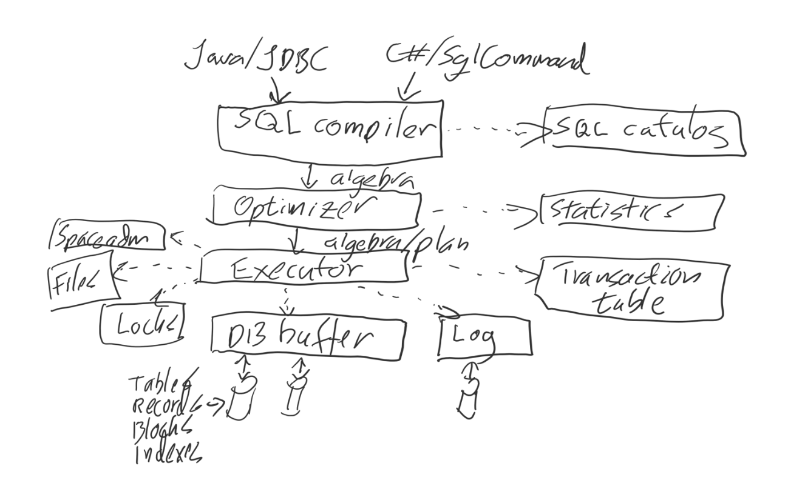
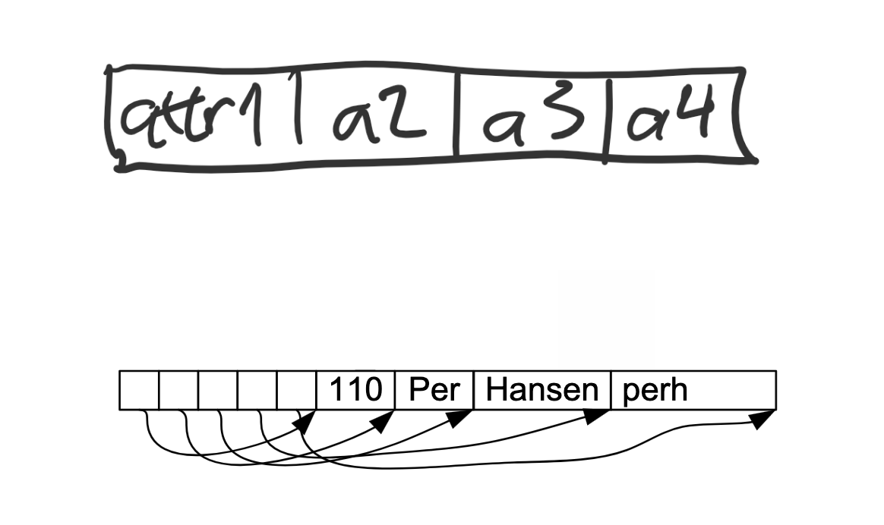
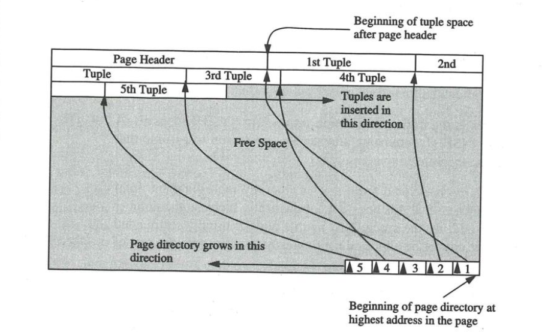
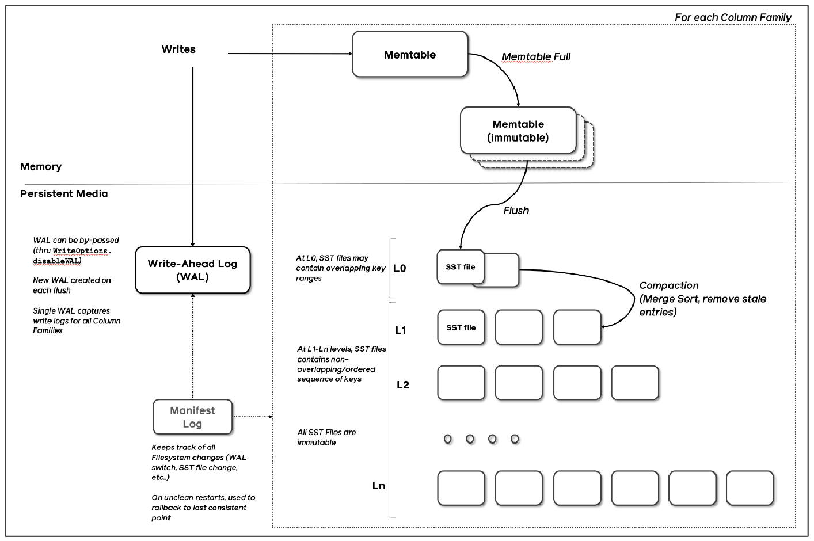

# Lagring og indekser

## Databasearkitektur

  

## Databasetjener vs. Innebygd DB
- Vanligvis er et databasesystem på egen tjener/server/datamaskin som kontaktes via et nettverksgrensesnitt.
> Eksempel: Programmering i Java medJDBC mot MySQL
- Noen databaser er innebygde (embedded) i applikasjonen via biblotekskall. 
> Eksempel: Programmering i Python mot SQLite3
- Fordelen med tjenerutgaven er at mange applikasjoner kan dele databasen, og derfor får databasen mye større "verdi" enn en innebygd database.

## Databaselagring
- Databaser lagres i filer eller på "raw devices"
    - Mest vanlig med filer, Direkte I/O på filer
    - "raw devices" unngår operativsystemets buffer
    - Noen bruker MMAP-segmenter
- Lagring av tabeller
    - Heapfil
    - B+-trær
    - Hashfil
    - LSM-trær
- Lagring av indeksfiler (på attributter)
    - For å få rask tilgang til data i tabellene
    - Eller tvinge gjennom PK/UNIQUE-restriksjoner
        - Hashing
        - B+-trær
        - R-trær (flere dimensjoner)
    - For sortering av nøkler
- Kan kombinere lagring og indekser: Clustered index.

## Lagring av poster
- En rad i en tabell er vanligvis lagret som en post (record) i en fil: tuppel vs rad vs post.
- En post har felter med navn og datatype
    - Integer, long integer, floating point (4 og 8 byte)
    - String (fast og variabel lengde, 1 eller 2 byte pr tegn). Kalles også TEXT. 
    - Date/time
    - Blobs - lange felter
    - JSON (tekst)
- SQL-dictionary (catalog) beskriver hvordan en tabell/post er lagret.
    - Lengde og datatyper
    - + mye annet

## Postlayout - 2 metoder

  

## Blocklayout

  

## Buffer
- Kopi i RAM av ofte brukte blokker fra databasen
- Databaser vil gjerne ha kontroll på dataene i RAM, så de "pinnes" slik at "virtual memory" ikke kaster de ut. 
- Adaptive cache-algoritmer, med flere klasser av aksessmønstre
- Kan også støtte "pre-fetching" av blokker
- Det brukes som regel en hashbasert inngang til buffer basert på BlockID
- Blokker som tilhører samme hashinngang lenkes sammen i RAM
- Blokker skrives til disk som en del av sjekkpunkting i forbindelse med logging og recovery

## Heapfiler
- "Rått" og usortert lager av poster
- Poster settes inn på slutten av filen. Kan være to lister

  

- Aksesseres med en **RecordID** (BlockID, nr innen blokk)
- Vanligbis har man indekser i tillegg til heapfiler
- + lett å sette inn posten
- + god til tabellscan
- + bra skriveytelse
- - Dårlig til søk på attributter og rangesøk (verdiområdesøk)

## Hashbaserte indekser
- Bra for direkte aksess på søkenøkkel
- h(K) - hashfunksjon av søkenøkkel
    - Sprer postene bra utover slik at de lett kan gjenfinnes
> Eksempel: h(K) = K mod M (restfunksjon)
- Mange mulige hashfunksjoner
- En god hashfunksjon har god spredning, men er avhengig av hva som skal spres
- Hvordan håndtere overflyt
    - Åpen adressering: lagre posten i første ledige etterfølgende blokk i fila. Kan også lenke her.
    - Separat overløp: lenk sammen overløpsblokker
    - Multippen hashing: bruk en ny hashfunksjon når det blir kollisjoner

## Extendible hashing
- Problem ved statisk hashing
    - Utvidelse av filen, dvs dobling av antall blokker
    - Les alle blokker og skriv alle blokker på nytt
- Extendible hashing
    - Bruk katalog med pekere til blokker og doble katalogen ved behod
    - Splitt (les og skriv) kun den blokken som ble full
    - Lokal og global dybde
    - Hvis en blokk er full og lokal dybde == global dybde: Directory doubling

## Hvorfor bruke indekser? 
- For å bruke queries raskere
    - **Student** (prn, studnr, navn, adresse, epost)
    - SELECT navn, adresse FROM Student WHERE studnr = 123456;
    - **Film** (id, fnavn, år, selskap, nasjonalitet, score)
    - SELECT fnavn, år FROM Film WHERE score > 7.0;
- For å tvinge gjennom UNIQUE og PK restriksjoner  
    - **Student** (*prn*, studnr, navn, adresse, epost)

## Begreper innen indeksering
- **Indeksfelt**: Felt/attributt av posten som indeksen bruker
- **Primærindeks**: Indeks på primærnøkkelen
- **Clustered indeks**: Indeks på en tabell hvor postene er fysisk lagret sammen med (i) indeksen
- **Sekundærindeks**: Ekstra indeks på et annet felt hvor det også finnes en primærindeks
    - Kan være brukt for å tvinge gjennom UNIQUE, dvs. en unik verdi for hver post i tabellen: **Student** (prn, studnr, navn, adresse, epost)

## Lagrings- og indekseringsmuligheter
- Systemspesifikt, se dokumentasjon av "ditt" system
- Clustered B+-tree/clustered index
    - B+-tre på primærnøkkel
    - Løvnivå av treet lagrer selve posten
    - MySQL: InnoDB
    - SQL Server: Clustered index når PK er definert
- Heapfil og B+-tre
    - Tabell lagret i heapfil
    - B+-tre på primærnøkkel. Postene blir da (key, RecordID)
    - Evt. annen indeks på et annet felt
    - MySQL: MyISAM
    - SQL Server: Heap + unclustered index
- Heapfil
    - Postene lagres fortløpende uten noen annen organisering
    - SQL Server: Hvis PK ikke er definert
- Clustered hash index
    - Hashindeks på PK
    - Posten lagret i indeksen
    - Oracle: Hash cluster
- LSM-trees (log-structured merge trees)
    - Moderne lagrings- og indekseringsmetode for Big Data
    - "Cacher" de nyeste innsatte/oppdaterte postene
    - Høy skriveytelse, lav "write amplification", bedre komprimering
    - Eldre poster flyttes over i "langtidslager" (flere nivåer)
    - SQLite3, NoSQL, RocksDB, MySQL/myRocks, Apache Hbase
- Column stores
    - Tradisjonelt lagres tabellens rader i SQL-databaser
    - Analyseapplikasjoner/datavarehus vil oppleve bedre ytelse med kolonnebasert lagring
    - Leser mindre data ved queries og kan bruke komprimering
    - Kan komprimere på flere måter
    - SELECT MAX(score) FROM Film; 
    - SQL Server: Columnstore index + *delta store* for å samle nok oppdateringer til  å flette sammen med kolonnen. 
    - Apache Kudu (Hadoop platform), C-store/VoltDB
    - AI-genererte indekser (f.eks Recursive Model Indexes)
        - Indekser laget basert på maskinlæring
        - Svært effektive på read-only data, men sliter med oppdateringer

## B+-trær
- Den mest brukte indeksen
- Høydebalansert tre med blokker som noder
- Alle "brukerposter" er på løvnivå ("nederst)
- Typisk høyde: 2, 3 eller 4
- Minimum 50% fyllgrad i blokker
- Gjennomsnittlig 67% fyllgrad i blokker
- Postene er sortert på nøkkelen, og treet støtter da
    - Likhetssøk (direktesøk)
    - Verdiområdesøk
    - Sekvensielle, sorterte scan
    - Gode på det meste, også for dynamiske datamengder

## B+-trær i praksis
- Typisk fanout: 133
- Typisk fyllgrad: 67%
- Typisk kapasitet (non-clustered B+-tree)
    - Høyde 4: 133^4 = 312 900 700 poster
    - Høyde 3: 133^3 = 2 352 637 poster
- Clustered B+-tre
    - Høyde 4: 133 * 133 * 133 * 20 = 47 millioner poster
- I praksis er de øverste nivåene alltid i buffer (RAM)
    - Level 3 - 1 blokk - 8 KB
    - Level 2 - 133 blokker - 1 MB
    - Level 1 - 17 689 blokker - 133 MB
    - Level 0 - 2,3 mill blokker - 18 MB

## Poster i B+-trær
    - Tabell: Student (*prn*, studnr, navn, adresse, epost)
    - Clustered B+-tree
    - Løvnivå (level=0):
        - Hver post på løvnivå vil se slik ('010195 12345', 123456, 'Hans Hansen', 'Revekroken 1', 'hans@stud.ntnu.no')
        - Hver blokk på løvnivå kan inneholde ca. 150 poster (avhengig av blokkstørrelse)
    - Level > 0 (indeksnivå):
        - ('020194 23456', BlockID)
        - Hver blokk kan inneholde ca. 600 poster (antar indekspost er 1/4 av en vanlig post)

## Blokksplitting i B+-tre
- Splitting vanligvis ved midterste post
- Størrelsesmessig midterste post ved variabel lengde poster
- Maks poststørrelse kan være 1/2 blokk, men spesialløsninger for virkelig lange poster (BLOBs)
- Indeksposter (level > 0) er små: nøkkel + BlockID
- Løvnodeposter kan være større. Hvorfor?

## Indekser på sammensatte nøkler
- Employee (ssn, dno, age, street, zip, salary, skill)
- SELECT * FROM Employee WHERE dno = 4 and age > 50;
- Hvilke indekser kan hjelpe her? 
    - Indeks på dno: finn alle poster med dno = 4 og sjekk om age > 50
    - Indeks på age: scan indekssen fra 50 og finn alle poster med dno = 4
    - Sammensatt indeks på 
        - (age, dno)
        - (dno, age)
        - Bruk den som er mest selektiv først, altså den som gir færrest poster i resultatet
    - Indekspostene har leksikalsk sortering

## LSM-trær, laget for BigData

  

