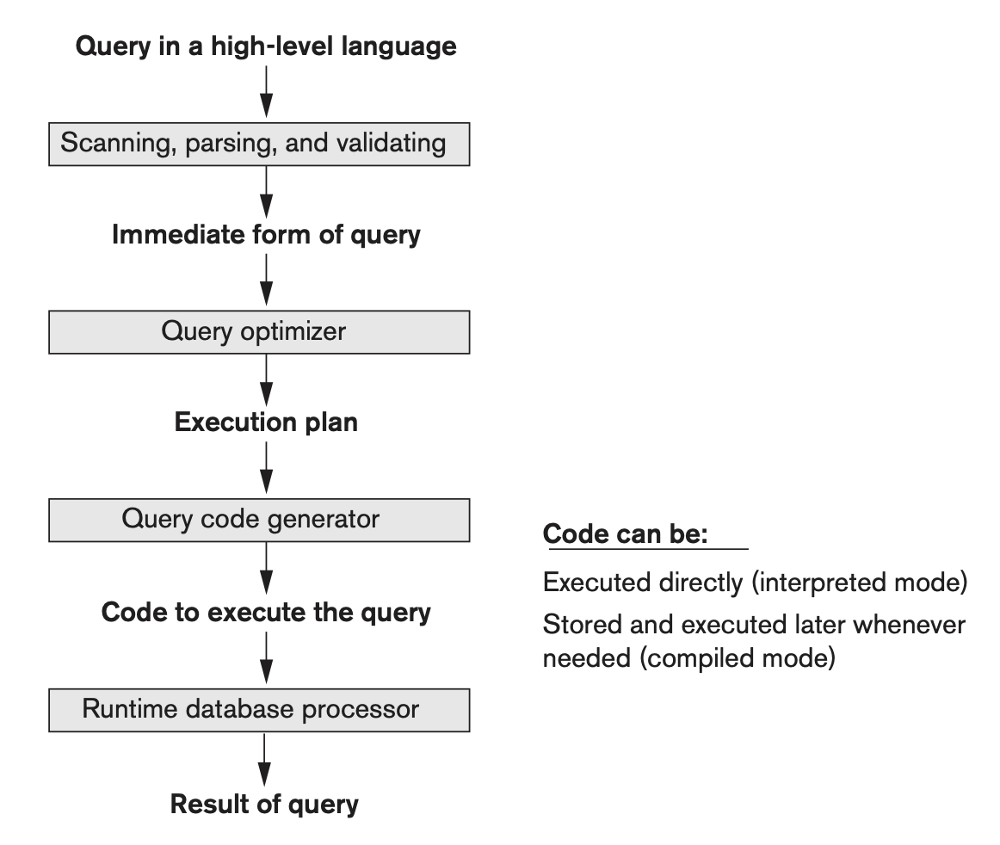
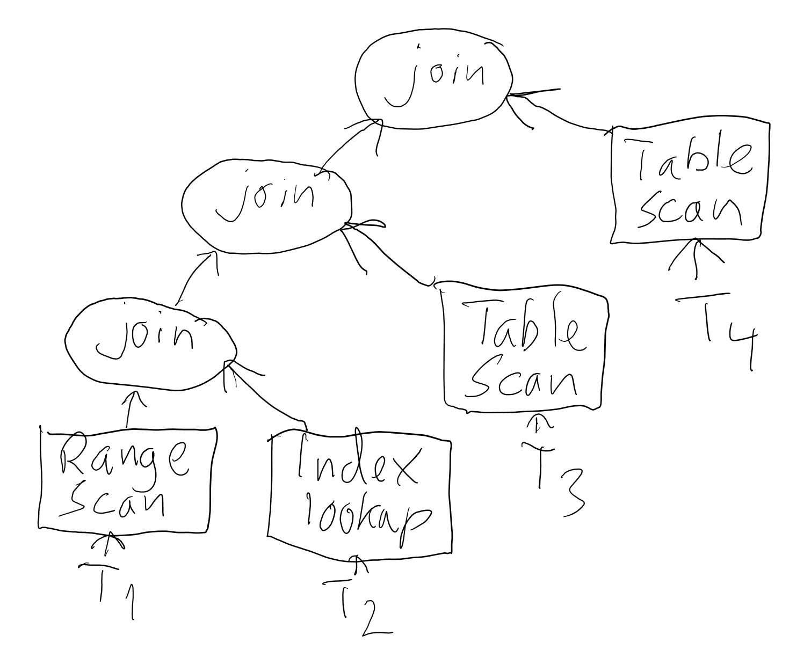
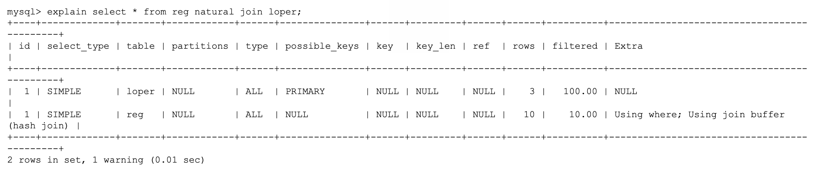
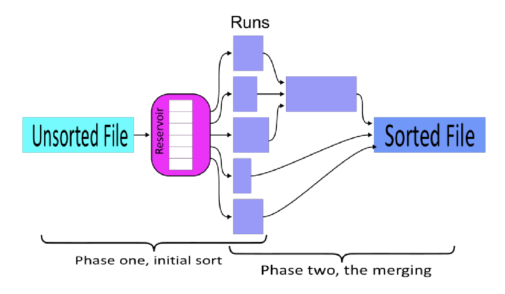

# Algoritmer for queryprosessering og optimalisering

## Fra Query til resultat

Arkitekturen til et typisk DBMS for kjøring av spørringer er vist i figuren nedenfor. En spørring mottas i SQL av en sesjonsbehandler som kaller på kompilatoren som lager en algebraisk versjon av spørringen. Dette gjøres ved å kontakte SQL-ordboken for å vite oppsettet til tabellen og dens attributter, om det er noen indekser, begrensinger etc. Spørringer sendes til optimizeren som leser statisikk om tabellen, f.eks. høyden på B+-trær, den minste og største nøkkelen til en indeks, antall blokker i en heap-fil, B+-tre, osv. Dermed kan den beregne hvilken som er den raskeste tilgangsmåten/-stien for å krysse en spesifikk tabell for en gitt spørring. I tillegg til dette vil den generere fører utførelses planer for spørringen der den beste er valg. Dette regnes vanligvis som "svartekunster", dvs. at det er en kompleks prosess som bruker mange triks, f.eks. vurderer den hvordan join trees mellom flere tabeller skal lages for å minimere antall datablokker som skal skannes.

  

## Teknikker for å utføre relasjonsalgebraoperasjoner
- **Indeksering**: Bruk WHERE-uttrykk til å trekke ut små mengder poster (seleksjon, join)
- **Iterajson**: Ofte er det raskest å scanne hele tabeller
- **Partisjonering**: Sortering og hasjing av input gir operasjoner på mindre datamengder

## Statisikk om data
- For hver rad
    - #rader
    - #blokker
- For hver indeks
    - #nøkkelverdier
    - #blokker
    - histogrammer
- For hvert B+-tre
    - trehøyde
    - lowKey
    - highKey
    - #blokker

## Akessvei
- Access path / search method (E & N)
- Optimalisatoren velger den billigste akessveien
- Måles i *antall blokker* som akesseres (+ CPU-bruk)
- 1. Filscan (tabellscan)
- 2. Indeks
    - Indeksscan
    - Rangescan
    - Indeks lookup

## Optimalisatortre

  

## Bruk explain i MySQL
- MySQL leser tabellene i den gitte rekkefølgen
- ALL: Full table scan

  

## Flettesortering

- Merge-sort: Sortering av store datamengder
- 2 faser

  

1. Partisjonering
    - Sorterer deler (partisjoner) som får plass i RAM
        - Antall deler (partisjoner): $n_{R}$
        - Antall blokker av data: $b$
        - Tilgjengelig buffer: $n_{B}$
2. Fletting
    - Flett sammen sorterte delfiler i et antall pass
    - Flettegrad $d_{m}$ - antall delfiler som kan flettes i hvert pass
    - Flettepass - antall pass som filene må flettes i

Regner ut total I/O - antall blokker som leses/skrives

## Metoder for enkle seleksjoner

- Lineært fil/tabellscan (S1)
- Bruk B+-tre eller hashindeks (clustered index) (S5)
- Bruk sekundærindeks (unclustered index) (S6)

## Metoder for utføring av join
- J1: Nested-loop join
    - For hver blokk i den ene tabellen: Scan hele den andre tabellen og se etter match
- J2: Single-loop join (index nested loop)
    - Loop gjennom den ene tabellen og bruk en indeks for å slå opp i den andre
- J3: Sort-merge join
    - Hvis begge tabellene er sorterte på joinattributtene, kan vu bare flette de
    - Hvis ikke, kan de sorteres først, og så flettes
- J4: Partition-hash join
    - Partisjoiner tabellene ved hashing på joinattributtene
    - Får mange små partisjoner som kan joines parvis i RAM
