# Transaksjoner

## Hvorfor transaksjoner? 

- Støtter deling og samtidig akess av data 
    - Flerbrukskontroll. READ COMMITTED, SNAPSHOT ISOLATION, SERIALIZABLE
- Støtter sikker pålitelig, atomisk aksess til store mengder data
    - Recovery: Rollback og krasjrecovery


## Databaseoperasjoner

- X - databaseobjekt: post eller blokk
    - read (x)
    - r (x)
    - write (x)
    - w (x)
- Tilhørende transaksjon 1
    - $read_{1}(X)$
    - $r_{1}(X)$
- Commit1 $c_{1}$ suksess: avsluttning av transaksjon 1
- Abort1 $a_{1}$ abortering av transaksjon 1

## Samtidighetsproblemer, eksempel

- To transaksjoner
<p align="center">
  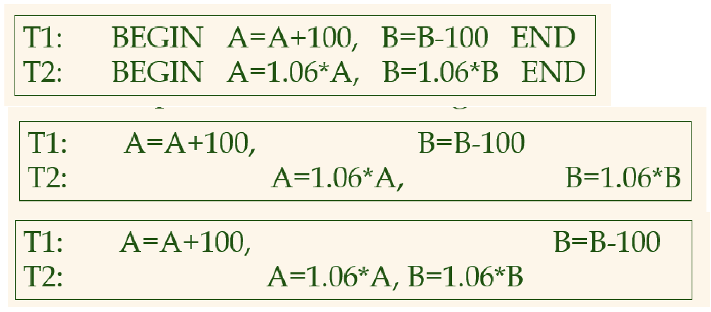
</p>

- $r_{1}(A)$; $w_{1}(A)$; $r_{2}(A)$; $w_{2}(A)$; $r_{2}(B)$; $w_{2}(B)$; $r_{1}(B)$; $w_{1}(B)$; 
<p align="center">
  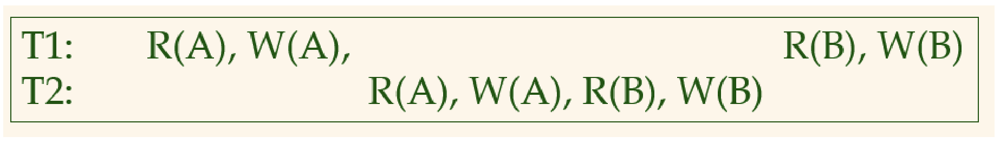
</p>

- Dirty read
<p align="center">
  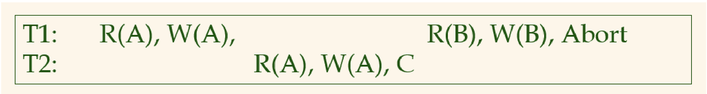
</p>

- Lost update / dirty write
<p align="center">
  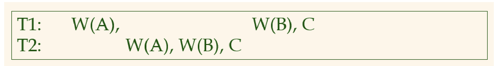
</p>

- Example: Lost update / dirty write
    - $w_{1}(buyer='Alice')$; $w_{2}(buyer='Bob')$; $w_{2}(invoice='Bob')$; $w_{1}(invoice='Alice')$
- Unrepeatable read / "read skew"
<p align="center">
  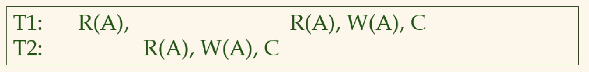
</p>

- Incorrect summary
    - En transaksjon som beregner en aggregatfunksjon mens en annen gjør en oppdatering
<p align="center">
  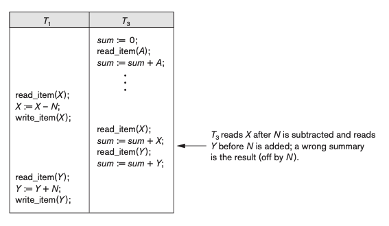
</p>


## Hvorfor trenger vi recovery? 

- To typer recovery (gjenoppretting)
- En transaksjon ruller tilbake (aborteres)
    - Uventet situasjon
    - Manglende data
    - Brukeren bestemmer det
    - Samtidighetskontrollen bestemmer deg (CC)
- Systemkrasjrecovery
    - Databasesystemet, OS'et eller datamaskinen krever en restart


## ACID - egenskaper ved en transaksjon

Transaksjon: en gruppering av operasjoner mot databasen som er
- A – atomiske: enten kjører de fullstendig, eller så kjører de ikke
- C – consistency: overholder konsistenskrav (primary key, references, check, osv)
- I – isolation: som er isolert fra hverandre. Merker ikke at noen kjører samtidig.
- D – durability: er permanente, dvs. mistes ikke etter commit.
En transaksjon er vanligvis en logisk operasjon eller oppgave


## Eksempler på transaksjoner
- En gruppering av operasjoner mot databasen
- Banktransaksjon
- Kjøp av mange varer
- Kjøp en flyreise
- Tegn en polylinje
- Fyll ut et skjema
- Lever en eksamen
- Setter inn poster so har indekselementer som også må oppdateres


## Commit/Abort

- En transaksjon slutter med
    - **COMMIT**: Alt gikk bra og endringene fra transaksjonen finnes i databasem. Connection.commit();
    - **ROLLBACK** (abort): Transaksjonen  rulles tilbake (aborteres) og ingen endringer fra transaksjonen finnes i databasen. Connection.rollback()
    - **Autocommit**: Hver SQL-setning er en egen transaksjon- Kan skrus på. Default av i Python/SQLite3-API. Setter via isolation_level i connection-objektet.

```SQL
SET AUTOCOMMIT=0;
UPDATE Account SET b = b - 1000 WHERE id=123123;
UPDATE Account SET b = b + 1000 WHERE id=234234;
COMMIT;
```

- Ekt-eksempel RegMålCtrl
```SQL
INSERT INTO Reg VALUES (1,123123,31,100);
INSERT INTO Reg VALUES (2,123123,32,120);
….
INSERT INTO Reg VALUES (9,123123,175,245);
UPDATE Loper SET status = ‘ok’
WHERE brikkenr=123123;
COMMIT;
```


## SQLs isolasjonsnivå 

```SQL
SET TRANSACTION ISOLATION LEVEL
    READ UNCOMMITTED
    READ COMMITTED
    REPEATBALE READ
    SERIALIZABLE (default)
```

- Mer isolasjoon/"korrekthet" nedover
- Mindre samtidighet nedove
- Egenskaper vi vil unngå:
    - Dirty read
    - Unrepeatable read
    - Unngå fantomer: Hvis T leser en mengde verdier basert på en søkebetingelse, så vil ikke denne mengden endres av andre før T er ferdig. Aktuelt ved rescanning (nested loop f.eks)

<p align="center">
  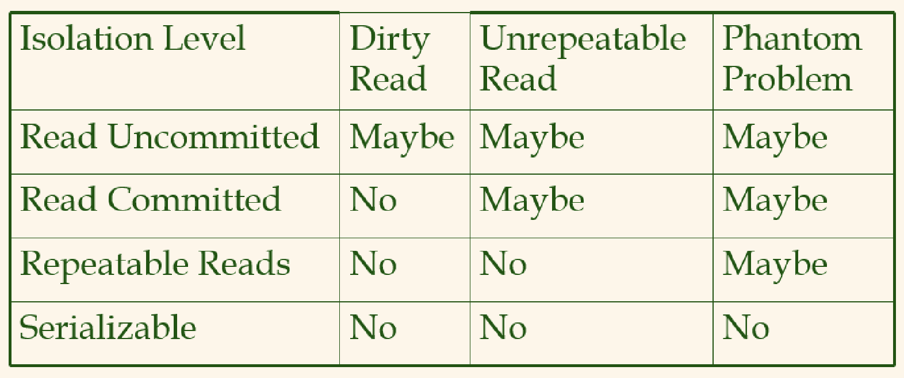
</p>

## READ COMMITTED

1. Når du leser fra databasen, vil du kun se data som er commmitted (ingen _dirty reads_)
2. Når du skriver til databasen, skriver du kun over data som er committed (ingen _dirty writes_)

READ COMMITED er default i Oracle, MS SQL Server og PostgreSQL.

To metoder brukes for å støtte dette.

1. _Låsing_: Transaksjonene setter skriverlåser før de skriver data. Låsene slippes ved commit. Før de leser et element, så setter transaksjonen "leselås", og slipper denne etter at dataelementet er lest. 
2. _Snapshot isolaiton_: Mange databaser hindrer dirty reads ved å beholde gamle verdier for data ved skriving inntil commit av transaksjonen. Read-transaksjoner kan lee den gamle verdien. Når den nye verdien er committed, kan andre transaksjoner ta den i bruk. Å ha leselåser vil holde alle writes unna, så det gjør man ikke. Dette kalles også fro "multi-version concurrency control". 

## SNAPSHOT ISOLAITON

- Snapshot isolation brukes som løsning på "unrepeatable read" ("read skew")
- Brukes av PostgreSQL, MySQL/InnoDB, Oracle, SQL Server, og andre
- Bruker write locks, men reads krever ikke låser
- Lesere blokkerer aldri skrivere, skrivere blokkerer aldri lesere
- Multi-version concurrency control (MVCC). Lagrer føere versjoner av oppdaterte rader. En for hver snapshot.


## Transaksjonshistorie

- **Historie** (schedule): Liste av aksjoner **r**ead, **w**rite, **a**bort, **c**ommit for en mengde transaksjoner

<p align="center">
  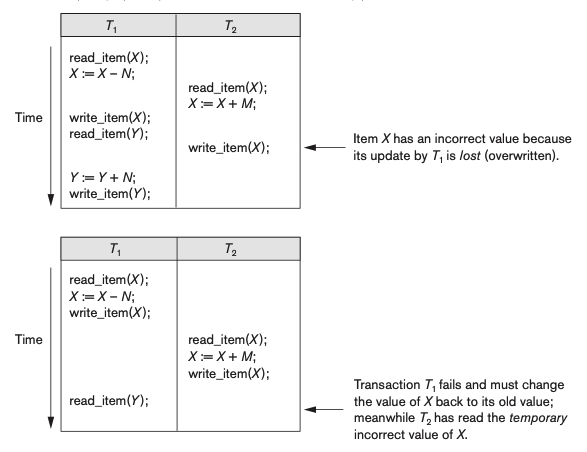
</p>

<p align="center">
  <b>H<sub>a</sub>: r<sub>1</sub>(X); r<sub>2</sub>(X); w<sub>1</sub>(X); r<sub>1</sub>(Y); w<sub>2</sub>(X); w<sub>1</sub>(Y);</b><br>
  <b>H<sub>b</sub>: r<sub>1</sub>(X); w<sub>1</sub>(X); r<sub>2</sub>(X); w<sub>2</sub>(Y); r<sub>1</sub>(Y); a<sub>1</sub>;</b>
</p>

- **Konflikt**: To operasjoner fra en historie er i konflikt hvis
    - de tilhører forskjellige transaksjoner
    - de bruker samme dataelement
    - minst en av operasjonene er en write
        - $H_{a}: r_{1}(X) og w_{2}(X)$ er i konflikt
        - $H_{a}: w_{1}(X) og w_{2}(X)$ er i konflikt
        - $H_{a}: r_{1}(X) og r_{2}(X)$ er _ikke_ i konflikt
    - To operasjoner er i konflikt hvis endring av rekkefølgen endrer resultatet på databasen

## Transaksjoner og gjenopprettbarhet

- **Gjenopprettbar historie** (recoverable schedule): Hver transaksjon committer etter at transaksjoner de har lest fra har committet: $H_{1}: w_{2}(A); w_{1}(B); w_{1}(A); r_{2}(B); c_{1}; c_{2};$

- Historier som unngår galopperende abort (avoid cascading abort - **ACA**): Når transaksjoner kun kan lese verdier skrevet av committede transaksjoner.  $H_{1}$ er ikke ACA. $H_{2}: w_{1}(A); w_{1}(B); w_{2}(A); c_{1}; r_{2}(B); c_{2};$


## Historier og gjenopprettbarhet

- **Strikt historie**: Når transaksjonene verken kan lese eller skrive ikke-committede verdier $H_{3}: w_{1}(A); r_{1}(B); w_{2}(B); c_{1}; w_{2}(A); c_{2};$
- Kan gjøre _undo recovery_ ved _before image_ fra loggen
- Sammenheng: $Strikt \subset ACA \subset Gjenopprettbar \subset Alle historier$


## Historier og serialiserbarhet

- **Seriell historie**: Historie som ikke fletter operasjoner fra forskjellige transaksjoner. Kjører etter hverandre. 
- **Serialiserbar historie**: Historie som har samme efffekt på databasen som en seriell historie (resultatekvivalent)
- Vi ønsker _serialiserbare_ og ikke kreve serielle historier fordi vi ønsker samtidighet
    1. Parallelle tråder
    2. Diskaksess - andre tråder kan jobbe så lenge

<p align="center">
  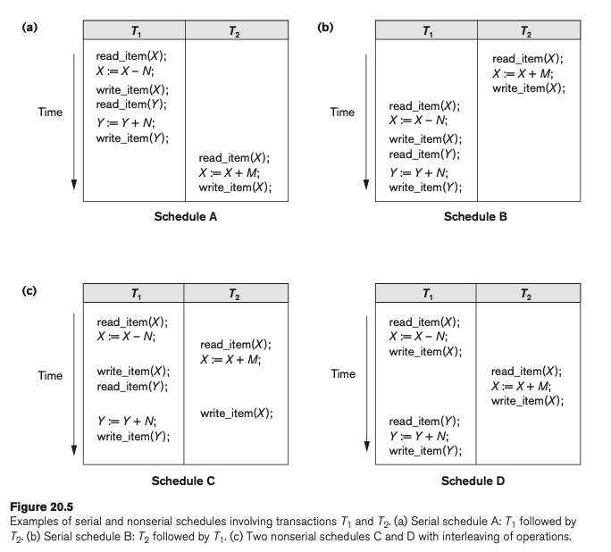
</p>


## Konfliktserialiserbarhet

- Konflikt mellom to operasjoner
    - $r_{1}(A) \text{ og } w_{2}(A)$
    - $w_{1}(A) \text{ og } r_{2}(A)$
    - $w_{1}(A) \text{ og } w_{2}(A)$
- To historier er _konfliktekvivalente_ hvis de har samme rekkefølge for operajoner med konflikt
- En historie er _konfliktserialiserbar_ hvis den er konfliktekvivalent med en seriell historie
- Konfliktserialiserbarhet impliserer serialiserbarhet, men ikke nødvendigvis motsatt
> Se c) og d) på figuren over


## Presedensgraf

- Rettet graf
- _Noder_: transaksjon i historie H
- _Kanter_: $T_{1} \rightarrow T_{2}$ finnes når det finnes en operajson i $T_{1}$ som er i konflikt emd en operajsoni $T_{2}$, og $T_{1}s$  operasjon skjer før $T_{2}s$  operasjon
- Hvis en presendensgraf ikke har _sykler_, er historien **konfliktserialiserbar**. 
  - $H_{1}: r_{2}(A); r_{1}(B); w_{2}(A); r_{3}(A); w_{1}(B); w_{3}(A); r_{2}(B); w_{2}(B);$
  - $H_{2}: r_{2}(A); r_{1}(B); w_{2}(A); r_{2}(A); r_{3}(A); w_{1}(B); w_{3}(A); w_{2}(B);$


## Serialiserbarhet ved låsing

- Bruker låser av dataelement (poster eller blokker) for å garantere konfliktserialiserbarhet
- Låsetyper
  - **Read_lock (X)** (delt lås)
  - **Write_lock (X)** (eksklusiv lås)
- Flere transaksjoner kan ha read_lock (delt lås) på samme dataelement samtidig. 
- Det er også mulig med oppgradering og nedgradering av låser
  - Read_lock $\rightarrow$ Write_lock
  - Write_lock $\rightarrow$ Read_lock


## Implementasjon av låser

- Låsetabell i minne
  - Postlåser
  - Blokklåser
  - Tabellåser
  - Verdiområdelåser (unngå fantomer)
  - Predikatlåser (unngå fantomer)

- Eksempel: $w_{2}(B); r_{1}(A); r_{2}(A); r_{1}(B); r_{3}(B);$


## 2PL - tofaselåsing (two-phase locking)

- En transaksjon har tofaselåsing hvis alle låseoperasjoner skjer før alle opplåsingsoperasjoner

<p align="center">
  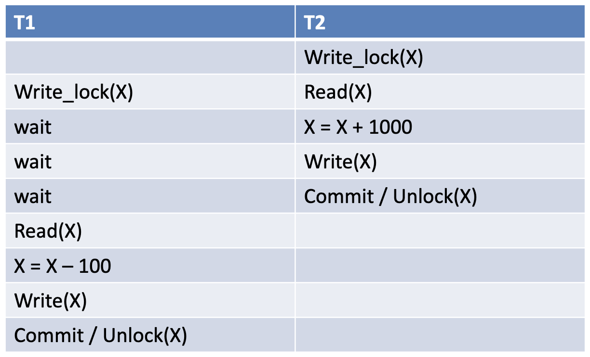
</p>


## 2PL impliserer serialiserbarhet
<p align="center">
  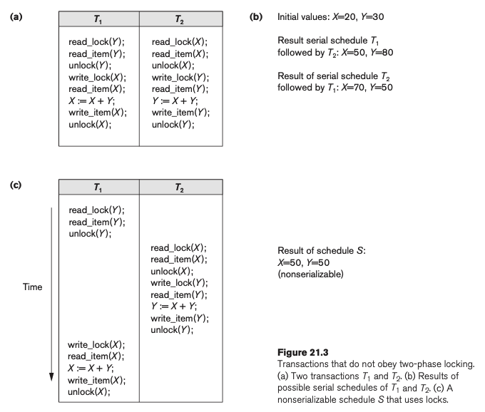
</p>


## 2PL-modeller

- Tofaselåsing impliserer serialiserbarhet
- **Basic 2PL**: "Symmetrisk fjell"
- **Konservativt 2PL**_: Låser alt man trenger aller først
- **Strict 2PL**: Opplåsing av skrivelåser etter commit/abort
- **Rigorous 2PL**: Opplåsing etter commit/abort


## Vranglås
- To eller flere transaksjoner venter gjensidig på hverandres låser
<p align="center">
  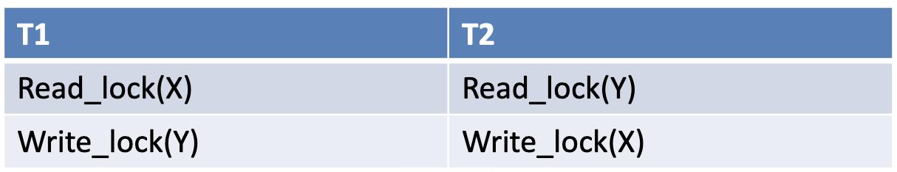
</p>

- Kan løses ved forskjellige metoder:
  - Unngåelse
  - Oppdagelse
    - Den vanligste løsningen
    - Konstruer wait-for-grafen: 
      - Hver transaksjon er en node
      - Hvis $T_{i}$ venter på en lås holdt av $T_{j}$, får vi en rettet kan $T_{i} \rightarrow T_{j}$
    - Vi har vranglås hvis grafen har sykler
    - Prøv å abortere en transaksjon og se om sykelen forsvinner
  - Timeout
    - Den enkleste løsningen
    - La hver transaksjon ha en timeout
    - Hvis timeouten går, aborter transaksjonen
    - Vanskelig å sette timeouten riktig

## Rigorous 2PL eksempel

- $H_1: r_1(A); w_2(A); w_2(B); w_3(B); w_1(B); c_1; c_2; c_3;$
- $H_2: r_1(A); w_2(B); w_2(A); w_3(B); w_1(B); c_1; c_2; c_3;$
- For _låsing_: His en transaksjon blir blokkert, blir alle operasjoner i transaksjonen satt på vent, mens de neste operasjonene i historien blir utført i sekvens

## Multi-Version Concurrency Control

- Brukes mye i dagens SQL-databaser
- Lar en leseoperasjon som er i konflikt, lese en gammel versjon
- Tradisjonelt basert på tidsstempelordning (timestamp ordering)
- Men bruker SNAPSHOT ISOLATION i dag

## SNAPSHOT ISOLATION

- Transaksjon 1 leser gammel versjon av B fordi $T_1$ startet før $T_2$ comittet
- Nye transaksjoner, startet etter $C_2$, vil lese de nye verdiene av A og B
<p align="center">
  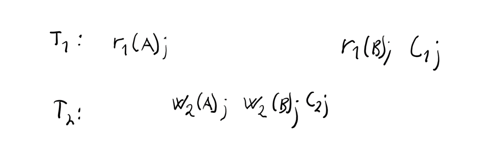
</p>

- To måter i praksis:
  1. Lagrer flere versjoner av poster i databasen og kjører GC (søppeltøøming) når de gamle versjonene ikke trenges lengre: Microsoft SQl, PostgreSQL, MySQL InnoDB (consistent reads)
  2. Lagrer kun siste versjon av posten, men kan konstrurere den forrige versjonen vha. undo: Oracle

## Recovery

- Databasesystemet støtter sikker, atomisk aksess til store mengder data
- Transaksjonene er 
  - A - atomiske: Enten har de kjørt helt, eller overhodet ikke
  - C
  - I
  - D - durability: Er permanente. Etter commit mistes ikke data.

## Transaksjoner etter krasjrecovery

- Vinnere: $T_1$, $T_2$ og $T_3$ skal være permanente
- Tapere: $T_4$ og $T_5$ må aborteres. Hvorfor?
<p align="center">
  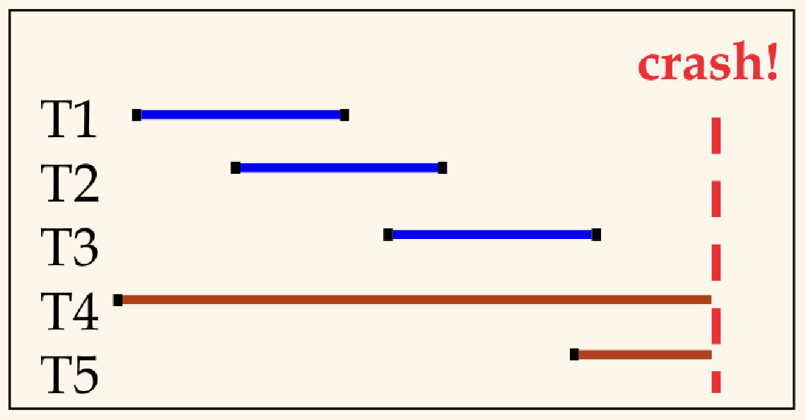
</p>

## Force/steal-klassifisering av Logging & Recovery-algoritmer

- Utgangspunkt: Hvor fleksibel (uavhengig) er _buffer manager_ til logging/recovery
  - Når kan skitne (dirty) blokker skrives?
  - Når må skitne blokker skrives?
- **Force**: Må en skitten (oppdatert) blokk tvinges til disk ved commit.
  - Tregt: datablokkene kan være spredd over hele disken
- **Steal**: Kan en transaksjon stjele plassen i bufferet til en skitten blokk?
  - Hvis ikke, må en aktiv transaksjon ha alle skitne blokker i buffer inntil commit.
<p align="center">
  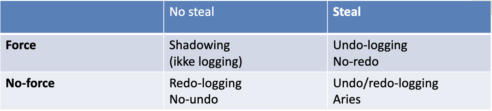
</p>


## Write-ahead logging (WAL)

- Basis for undo/redo-logging
- Hver endring (insert/delete/update) har en loggpost i loggen
- Regler: 
  - Skriv en loggpost som endret en datablokk til disk før du skriver datablokken (for undoformål)
  - Skriv loggen til disk før en transaksjon committer (for redoformål) "Force log at commit"


## WAL-konsepter i ARIES

- **LSN** - loggsekvensnummer. ID for loggpost. Stigende nr. 
- **PageLSN** - LSN til loggpost som sist endret en blokk. Lagret i hver blokk
- **FlushedLSN** - LSN til nyeste skrevne loggpost til disk
- Ved skriving av datablokk til disk, sjekk PageLSN <= FlushedLSN
- Hvis ikke, skriv (flush) logg først
<p align="center">
  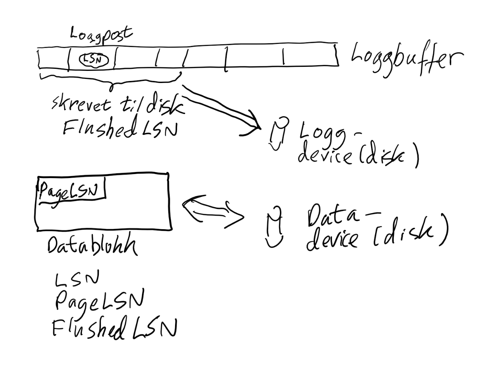
</p>


## Loggpost i ARIES
<p align="center">
  
</p>

- _PrevLSN_: Peker til forrige loggpost i tamme transaksjon. For abortering av transaksjon.
- _OpType_: update/insert/delete
- _PageID_: Hvilken blokk ble endret (BlokkID)
- _Offset_: Hvor i blokken ble det endret?
- _BeforeImage_: Verdi før endring
- _AfterImage_: Verdi etter endring

## Datastruktur for recovery (ARIES)

- **Transaksjonstabell**
  - Et element pr aktiv transaksjon
    - TransID
    - Tilstand: aktiv, committed, aborting, aborted
    - LastLSN: Peker til nyeste loggpost i transaksjonen
  - Transaksjonen blir borte når transaksjonen committer
- **Dirty Page Table (DPT)**
  - Et element per skitten (dirty) blokk i buffer
    - PageID
    - RecLSN: Peker til eldste loggpost som gjorde blokken skitten
  - Elementet blir borte når "disk callback" fra write blir kjørt


## Sjekkpunkting

- Periodisk lager DBMSet et sjekkpunkt i loggen som skal minimalisere tiden det tar å gjøre recovery
- Du slipper å scanne hele loggen ved recovery
  - Begin checkpoint
    - Lag start sjekkpunkt-loggpost
  - End checkpoint
    - Lag slutte sjekkpunkt-loggpost som inneholder
      - Transtabell
      - DPT - dirty page table
  - Lagre LSN tilk sjekkpunktloggpost på sikkert sted. Logganker
- I noen systemer er sjekkpunkting koblet til det å skrive skitne blokker til disk (ikke ARIES)
- Penulitmate checkpointing: Skriv data ved sjekkpunkting. Bruk nest siste sjekkpunkt som startpunkt
- Fussy checkpointing: Tillat samtidige transaksjoner


## Abortering av transaksjon

- Finn LastLSN fra transaksjonstabellen
- For hver loggpost i transaksjonen (bakover) 
  - Lag CLR - kompenserende loggpost, som gjør det motsatte av loggposten (non-CLR)
  - Gjør REDO av CLRen
- Fjern transaksjonen fra transaksjonstabellen
- CLRen er grunnlag for låser på radnivå (mer presise enn låser på blokker)


## Recovery etter krasj

- Mål: 
  - Sørge for at vinnertransaksjoner er permanente. De som har committed før krasj.
  - Sørge for at tapertransaksjoner blir borte (aborted). De som ikke committed før krasj.
- Faser: 
  1. **Analyse**: Finn vinnere og tapere. Rekonstruer DPT/TransTap
  2. **REDO**: Redo alle loggposter
  3. **UNDO**: Undo effekten av alle tapertransaksjoner
<p align="center">
  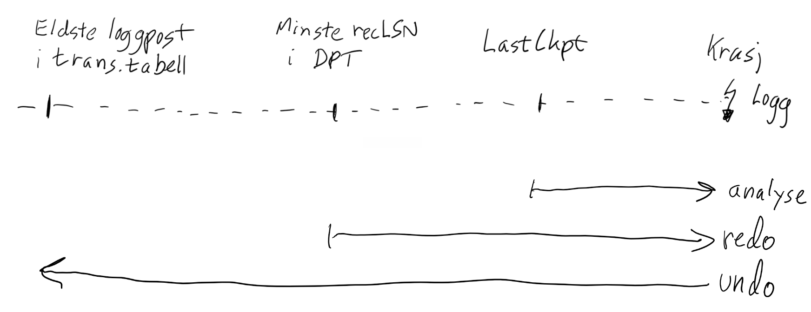
</p>

## REDO av loggpost (ARIES)

- Loggposten trenger ikke REDO hvis 
  1. Den tilhørende blokken ikke er i dirty page table (DPT)
  2. Blokken er i DPT, og recLSN er større enn loggpostens LSN
  3. Blokkens pageLSN er større enn loggpostens LSN. Her må blokken leses inn
- Ellers redo loggpost: 
  1. Sett inn / skriv inn after image inn i blokken
  2. Oppdater blokkens pageLSN til loggpostens LSN


## Andre recoveryteknikker
- _Undo/no-redo_: Som ARIES, men kun undo-logging
- _No-undo/redo_: Som ARIES, men kun redo-logging
- _Shadowing_: Bruker ikke logging, men lager kopier av data ved oppdatering. Committer transaksjonen ved å kopiere inn pekere til nye data. Må ha katalog med pekere til data. 
- Skiller mellom upade-in-place og shadowing